SARIMA
================

``` r
library(arrow)  
```

    ## Warning: package 'arrow' was built under R version 4.4.2

    ## The tzdb package is not installed. Timezones will not be available to Arrow compute functions.

    ## 
    ## Adjuntando el paquete: 'arrow'

    ## The following object is masked from 'package:utils':
    ## 
    ##     timestamp

``` r
library(dplyr)  
```

    ## 
    ## Adjuntando el paquete: 'dplyr'

    ## The following objects are masked from 'package:stats':
    ## 
    ##     filter, lag

    ## The following objects are masked from 'package:base':
    ## 
    ##     intersect, setdiff, setequal, union

``` r
file_path <- "../../1-DATOS/2-DATOS PROCESADOS/BICING/INFORMACION COMPLETA/BICICLETAS_HORARIO_2022_2023_FILTRADO.parquet"
data <- read_parquet(file_path)

if ("FECHA" %in% colnames(data)) {
  data <- data %>%
    mutate(FECHA = as.POSIXct(FECHA, format = "%Y-%m-%d %H:%M:%S"))
} else {
  stop("La columna 'FECHA' no se encuentra en los datos.")
}

# Filtra los datos entre 2022-03-01 y 2022-04-01 (se puede replicar el análisis 
# en cualquier otro periodo)
data_filtered <- data %>%
  filter(FECHA >= as.POSIXct("2022-03-01") & FECHA <= as.POSIXct("2022-04-01")) 

# Selecciona solo las columnas necesarias
data_filtered <- data_filtered %>%
  select(`494.0`, FECHA) 

data_filtered <- data_filtered %>%
  mutate(`494.0` = ifelse(`494.0` == 0, 0.1, `494.0`))

# Muestra el resultado
print(data_filtered)
```

    ## # A tibble: 744 × 2
    ##    `494.0` FECHA              
    ##      <dbl> <dttm>             
    ##  1   0.1   2022-03-01 00:00:00
    ##  2   0.1   2022-03-01 01:00:00
    ##  3   0.1   2022-03-01 02:00:00
    ##  4   0.1   2022-03-01 03:00:00
    ##  5   0.1   2022-03-01 04:00:00
    ##  6   0.1   2022-03-01 05:00:00
    ##  7   0.636 2022-03-01 06:00:00
    ##  8   1.75  2022-03-01 07:00:00
    ##  9  16.4   2022-03-01 08:00:00
    ## 10  14.3   2022-03-01 09:00:00
    ## # ℹ 734 more rows

``` r
serie <- ts(data_filtered['494.0'], frequency = 24)
```

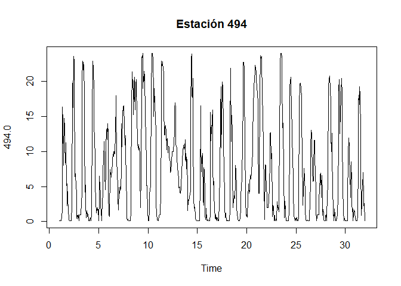<!-- --> Se
observa que la varianza no es constante.

``` r
m=apply(matrix(serie,nr=24),2,mean)
v=apply(matrix(serie,nr=24),2,var)
plot(m,v,xlab="Medias diarias",ylab="Varianzas diarias",main="serie")
abline(lm(v~m),col=2,lty=3,lwd=2)
```

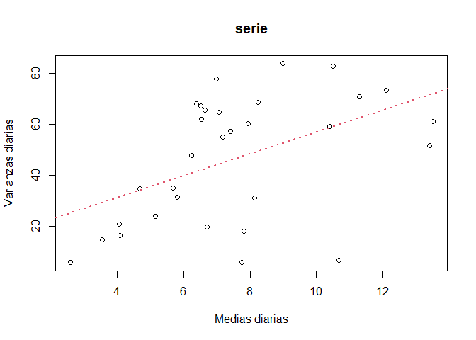<!-- -->

``` r
boxplot(serie~floor(time(serie)))
```

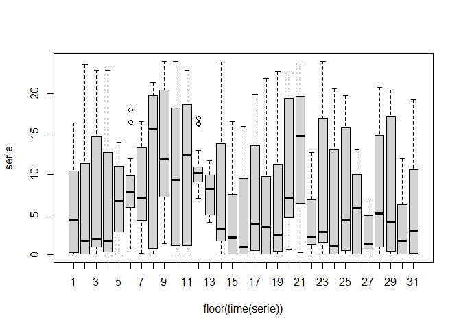<!-- -->
Se aplica transformación logarítmica para reducir la variabilidad.

``` r
lnserie=log(serie)
plot(lnserie)
```

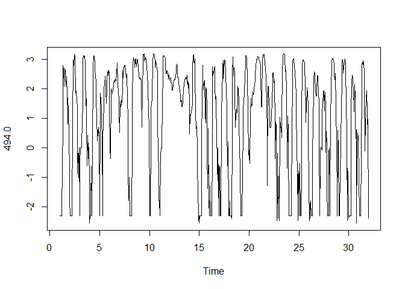<!-- -->

Se descompone el logaritmo de la serie para ver tendencia y
estacionalidad.

``` r
plot(decompose(lnserie))
```

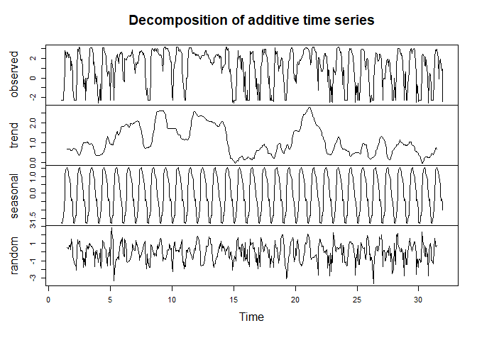<!-- -->
La serie tiene un claro patrón estacional horario.

``` r
# Cargar las librerías necesarias
library(ggplot2)

# Crear un vector que represente las horas del día para cada observación
# Como tienes una serie temporal con frecuencia de 24 (una por cada hora del día)
horas <- rep(0:23, length.out = length(lnserie))

# Crear un data frame con la serie y las horas
df <- data.frame(Hora = factor(horas, levels = 0:23), Valor = as.numeric(lnserie))

# Graficar los valores agrupados por hora del día
ggplot(df, aes(x = Hora, y = Valor)) +
  geom_boxplot() +
  labs(title = "Distribución de los Valores por Hora del Día",
       x = "Hora del Día", y = "Valor") +
  theme_minimal()
```

<!-- -->

Se estudia la existencia de tendencias en los datos:

``` r
d24lnserie=diff(lnserie,24)
plot(d24lnserie)
abline(h=0)
abline(h=mean(d24lnserie),col=2)
```

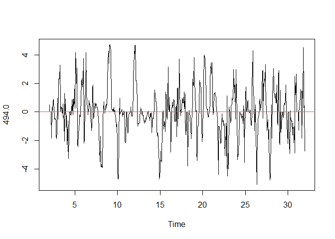<!-- -->
No parece haber evidencia de una tendencia en los datos. Sin embargo,
para garantizar que tengan una media constante, se aplica una
diferenciación regular.

``` r
d1d24lnserie=diff(d24lnserie,1)
plot(d1d24lnserie)
abline(h=0)
```

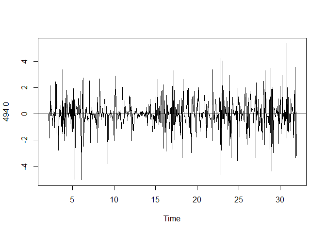<!-- -->

Se comprueba que no se esté realizando sobreajuste con excesivas
diferenciaciones.

``` r
var(serie)
```

    ##          494.0
    ## 494.0 51.97861

``` r
var(lnserie)
```

    ##          494.0
    ## 494.0 3.228568

``` r
var(d24lnserie)
```

    ##          494.0
    ## 494.0 2.777463

``` r
var(d1d24lnserie)
```

    ##          494.0
    ## 494.0 1.226969

``` r
d1d1d24lnserie=diff(d1d24lnserie,1) # No necesaria
var(d1d1d24lnserie)
```

    ##          494.0
    ## 494.0 2.655058

``` r
par(mfrow=c(1,2))
acf(d1d24lnserie,ylim=c(-1,1),col=c(2,rep(1,23)),lwd=2,lag.max=96, main="Autocorrelación de la Serie")
pacf(d1d24lnserie,ylim=c(-1,1),col=c(rep(1,23),2),lwd=2,lag.max=96, main="Autocorrelación Parcial de la Serie")
```

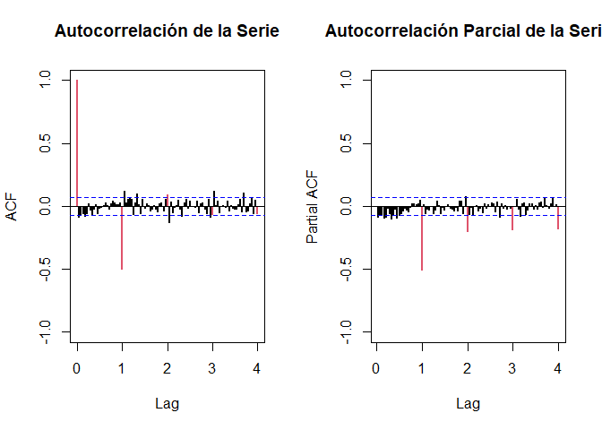<!-- -->

``` r
par(mfrow=c(1,1))
```

A partir de la autocorrelación y la autocorrelación parcial, se propone
un $SARIMA(1,0,1)(6,0,0)_{24}$.

``` r
(mod1=arima(d1d24lnserie,order=c(1,0,1),seasonal=list(order=c(6,0,0),period=24)))
```

    ## 
    ## Call:
    ## arima(x = d1d24lnserie, order = c(1, 0, 1), seasonal = list(order = c(6, 0, 
    ##     0), period = 24))
    ## 
    ## Coefficients:
    ##          ar1     ma1     sar1     sar2     sar3     sar4     sar5     sar6
    ##       0.8041  -1.000  -0.7988  -0.5819  -0.5346  -0.5356  -0.4261  -0.3045
    ## s.e.  0.0226   0.007   0.0366   0.0471   0.0492   0.0494   0.0501   0.0413
    ##       intercept
    ##          -4e-04
    ## s.e.      2e-04
    ## 
    ## sigma^2 estimated as 0.6203:  log likelihood = -870.41,  aic = 1760.82

## Validación

``` r
#################Validation#################################
validation=function(model,dades){
  s=frequency(get(model$series))
  resid=model$residuals
  par(mfrow=c(2,2),mar=c(3,3,3,3))
  #Residuals plot
  plot(resid,main="Residuals")
  abline(h=0)
  abline(h=c(-3*sd(resid),3*sd(resid)),lty=3,col=4)
  #Square Root of absolute values of residuals (Homocedasticity)
  scatter.smooth(sqrt(abs(resid)),main="Square Root of Absolute residuals",
                 lpars=list(col=2))
  
  #Normal plot of residuals
  qqnorm(resid)
  qqline(resid,col=2,lwd=2)
  
  ##Histogram of residuals with normal curve
  hist(resid,breaks=20,freq=FALSE)
  curve(dnorm(x,mean=mean(resid),sd=sd(resid)),col=2,add=T)
  
  
  #ACF & PACF of residuals
  par(mfrow=c(1,2))
  acf(resid,ylim=c(-1,1),lag.max=60,col=c(2,rep(1,s-1)),lwd=1)
  pacf(resid,ylim=c(-1,1),lag.max=60,col=c(rep(1,s-1),2),lwd=1)
  par(mfrow=c(1,1))
  
  #ACF & PACF of square residuals 
  par(mfrow=c(1,2))
  acf(resid^2,ylim=c(-1,1),lag.max=60,col=c(2,rep(1,s-1)),lwd=1)
  pacf(resid^2,ylim=c(-1,1),lag.max=60,col=c(rep(1,s-1),2),lwd=1)
  par(mfrow=c(1,1))
  
  #Ljung-Box p-values
  par(mar=c(2,2,1,1))
  tsdiag(model,gof.lag=7*s)
  cat("\n--------------------------------------------------------------------\n")
  print(model)
  
  #Stationary and Invertible
  cat("\nModul of AR Characteristic polynomial Roots: ", 
      Mod(polyroot(c(1,-model$model$phi))),"\n")
  cat("\nModul of MA Characteristic polynomial Roots: ",
      Mod(polyroot(c(1,model$model$theta))),"\n")
  
  #Model expressed as an MA infinity (psi-weights)
  psis=ARMAtoMA(ar=model$model$phi,ma=model$model$theta,lag.max=36)
  names(psis)=paste("psi",1:36)
  cat("\nPsi-weights (MA(inf))\n")
  cat("\n--------------------\n")
  print(psis[1:20])
  
  #Model expressed as an AR infinity (pi-weights)
  pis=-ARMAtoMA(ar=-model$model$theta,ma=-model$model$phi,lag.max=36)
  names(pis)=paste("pi",1:36)
  cat("\nPi-weights (AR(inf))\n")
  cat("\n--------------------\n")
  print(pis[1:20])
  
  ## Add here complementary tests (use with caution!)
  ##---------------------------------------------------------
  cat("\nNormality Tests\n")
  cat("\n--------------------\n")
 
  ##Shapiro-Wilks Normality test
  print(shapiro.test(resid(model)))

  suppressMessages(require(nortest,quietly=TRUE,warn.conflicts=FALSE))
  ##Anderson-Darling test
  print(ad.test(resid(model)))
  
  suppressMessages(require(tseries,quietly=TRUE,warn.conflicts=FALSE))
  ##Jarque-Bera test
  print(jarque.bera.test(resid(model)))
  
  cat("\nHomoscedasticity Test\n")
  cat("\n--------------------\n")
  suppressMessages(require(lmtest,quietly=TRUE,warn.conflicts=FALSE))
  ##Breusch-Pagan test
  obs=get(model$series)
  print(bptest(resid(model)~I(obs-resid(model))))
  
  cat("\nIndependence Tests\n")
  cat("\n--------------------\n")
  
  ##Durbin-Watson test
  print(dwtest(resid(model)~I(1:length(resid(model)))))
  
  ##Ljung-Box test
  cat("\nLjung-Box test\n")
  print(t(apply(matrix(c(1:4,(1:4)*s)),1,function(el) {
    te=Box.test(resid(model),type="Ljung-Box",lag=el)
    c(lag=(te$parameter),statistic=te$statistic[[1]],p.value=te$p.value)})))
  

  #Sample ACF vs. Teoric ACF
  par(mfrow=c(2,2),mar=c(3,3,3,3))
  acf(dades, ylim=c(-1,1) ,lag.max=36,main="Sample ACF")
  
  plot(ARMAacf(model$model$phi,model$model$theta,lag.max=36),ylim=c(-1,1), 
       type="h",xlab="Lag",  ylab="", main="ACF Teoric")
  abline(h=0)
  
  #Sample PACF vs. Teoric PACF
  pacf(dades, ylim=c(-1,1) ,lag.max=36,main="Sample PACF")
  
  plot(ARMAacf(model$model$phi,model$model$theta,lag.max=36, pacf=T),ylim=c(-1,1),
       type="h", xlab="Lag", ylab="", main="PACF Teoric")
  abline(h=0)
  par(mfrow=c(1,1))
}
################# Fi Validation #################################
```

No es un modelo válido, ya que no cumple con las suposiciones
estadísticas necarias: los residuos no siguen una distribución normal,
no son indepenpendientes y no tienen varianza homogénea.

``` r
dades=d1d24lnserie
model=mod1
validation(model,dades)
```

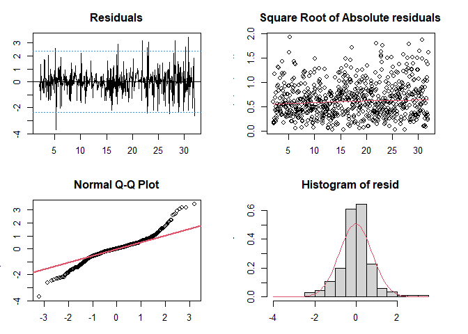<!-- -->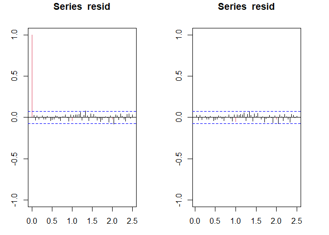<!-- -->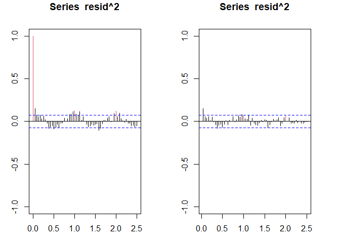<!-- -->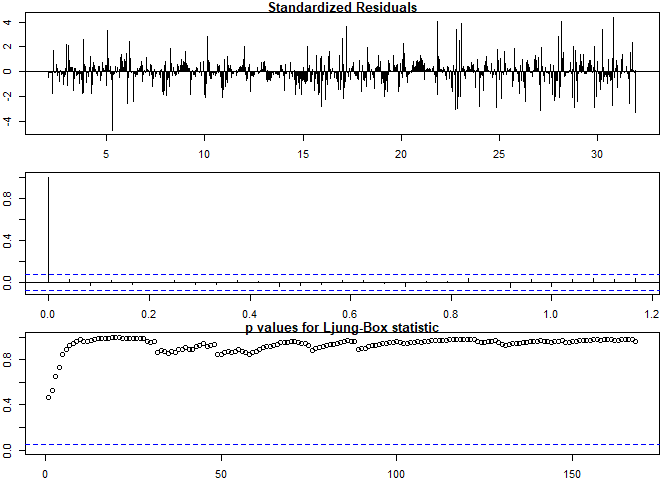<!-- -->

    ## 
    ## --------------------------------------------------------------------
    ## 
    ## Call:
    ## arima(x = d1d24lnserie, order = c(1, 0, 1), seasonal = list(order = c(6, 0, 
    ##     0), period = 24))
    ## 
    ## Coefficients:
    ##          ar1     ma1     sar1     sar2     sar3     sar4     sar5     sar6
    ##       0.8041  -1.000  -0.7988  -0.5819  -0.5346  -0.5356  -0.4261  -0.3045
    ## s.e.  0.0226   0.007   0.0366   0.0471   0.0492   0.0494   0.0501   0.0413
    ##       intercept
    ##          -4e-04
    ## s.e.      2e-04
    ## 
    ## sigma^2 estimated as 0.6203:  log likelihood = -870.41,  aic = 1760.82
    ## 
    ## Modul of AR Characteristic polynomial Roots:  1.006216 1.008263 1.006216 1.006216 1.006216 1.006216 1.008263 1.0104 1.006216 1.008263 1.008263 1.008263 1.006216 1.006216 1.0104 1.008263 1.006216 1.006216 1.0104 1.008263 1.006216 1.008263 1.008263 1.008263 1.006216 1.006216 1.006216 1.008263 1.0104 1.0104 1.006216 1.008263 1.008263 1.0104 1.008263 1.006216 1.008263 1.0104 1.0104 1.0104 0.7357449 0.7723728 0.8275937 1.006216 0.9078045 1.0104 1.008263 1.008263 1.006216 1.03179 1.0104 1.006699 1.0104 1.006216 0.9596415 1.0104 1.00622 1.006216 1.008263 1.008263 1.0104 1.052164 0.8412883 0.8947879 0.9218581 1.008264 1.0104 1.008263 1.006216 1.0104 1.0104 1.0104 0.9974341 1.029446 1.006216 1.087583 1.0104 1.082484 1.006216 1.008263 1.008321 1.074309 1.07991 1.043908 1.010403 1.006216 1.054546 1.010404 0.9786952 1.020211 1.0104 1.010192 1.005856 1.005966 1.0104 1.006216 1.243696 1.006216 1.081903 1.070568 1.0104 1.08334 1.006337 1.006216 1.022281 1.0104 1.010149 1.0104 1.031901 1.0104 1.0104 1.008263 1.006216 1.008263 1.041827 1.015407 1.008263 1.008263 1.011954 1.008263 1.076089 1.008263 1.0104 1.005737 1.006216 1.008263 1.018618 1.0104 1.0104 0.99749 1.008263 1.008263 1.018389 1.006216 1.013787 1.050401 1.040027 1.075663 1.020082 1.087846 1.078998 1.088412 1.085962 1.069923 1.060624 
    ## 
    ## Modul of MA Characteristic polynomial Roots:  1.000002 
    ## 
    ## Psi-weights (MA(inf))
    ## 
    ## --------------------
    ##        psi 1        psi 2        psi 3        psi 4        psi 5        psi 6 
    ## -0.195943483 -0.157549288 -0.126678254 -0.101856252 -0.081898003 -0.065850478 
    ##        psi 7        psi 8        psi 9       psi 10       psi 11       psi 12 
    ## -0.052947390 -0.042572600 -0.034230701 -0.027523358 -0.022130287 -0.017793962 
    ##       psi 13       psi 14       psi 15       psi 16       psi 17       psi 18 
    ## -0.014307320 -0.011503868 -0.009249740 -0.007437297 -0.005979994 -0.004808243 
    ##       psi 19       psi 20 
    ## -0.003866090 -0.003108548 
    ## 
    ## Pi-weights (AR(inf))
    ## 
    ## --------------------
    ##       pi 1       pi 2       pi 3       pi 4       pi 5       pi 6       pi 7 
    ## -0.1959435 -0.1959431 -0.1959428 -0.1959424 -0.1959421 -0.1959418 -0.1959414 
    ##       pi 8       pi 9      pi 10      pi 11      pi 12      pi 13      pi 14 
    ## -0.1959411 -0.1959407 -0.1959404 -0.1959400 -0.1959397 -0.1959393 -0.1959390 
    ##      pi 15      pi 16      pi 17      pi 18      pi 19      pi 20 
    ## -0.1959386 -0.1959383 -0.1959379 -0.1959376 -0.1959373 -0.1959369 
    ## 
    ## Normality Tests
    ## 
    ## --------------------
    ## 
    ##  Shapiro-Wilk normality test
    ## 
    ## data:  resid(model)
    ## W = 0.94106, p-value = 2.783e-16
    ## 
    ## 
    ##  Anderson-Darling normality test
    ## 
    ## data:  resid(model)
    ## A = 12.595, p-value < 2.2e-16
    ## 
    ## 
    ##  Jarque Bera Test
    ## 
    ## data:  resid(model)
    ## X-squared = 310.44, df = 2, p-value < 2.2e-16
    ## 
    ## 
    ## Homoscedasticity Test
    ## 
    ## --------------------
    ## 
    ##  studentized Breusch-Pagan test
    ## 
    ## data:  resid(model) ~ I(obs - resid(model))
    ## BP = 3.6011, df = 1, p-value = 0.05774
    ## 
    ## 
    ## Independence Tests
    ## 
    ## --------------------
    ## 
    ##  Durbin-Watson test
    ## 
    ## data:  resid(model) ~ I(1:length(resid(model)))
    ## DW = 1.9318, p-value = 0.1702
    ## alternative hypothesis: true autocorrelation is greater than 0
    ## 
    ## 
    ## Ljung-Box test
    ##      lag.df  statistic   p.value
    ## [1,]      1  0.5263777 0.4681338
    ## [2,]      2  1.2709890 0.5296735
    ## [3,]      3  1.6172716 0.6554800
    ## [4,]      4  2.0162213 0.7327752
    ## [5,]     24 11.1355478 0.9880120
    ## [6,]     48 34.0086761 0.9365652
    ## [7,]     72 52.8322665 0.9562982
    ## [8,]     96 75.2962289 0.9416127

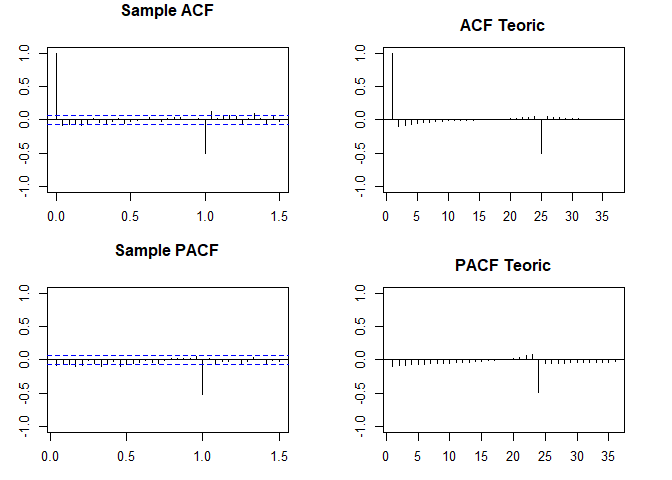<!-- -->
